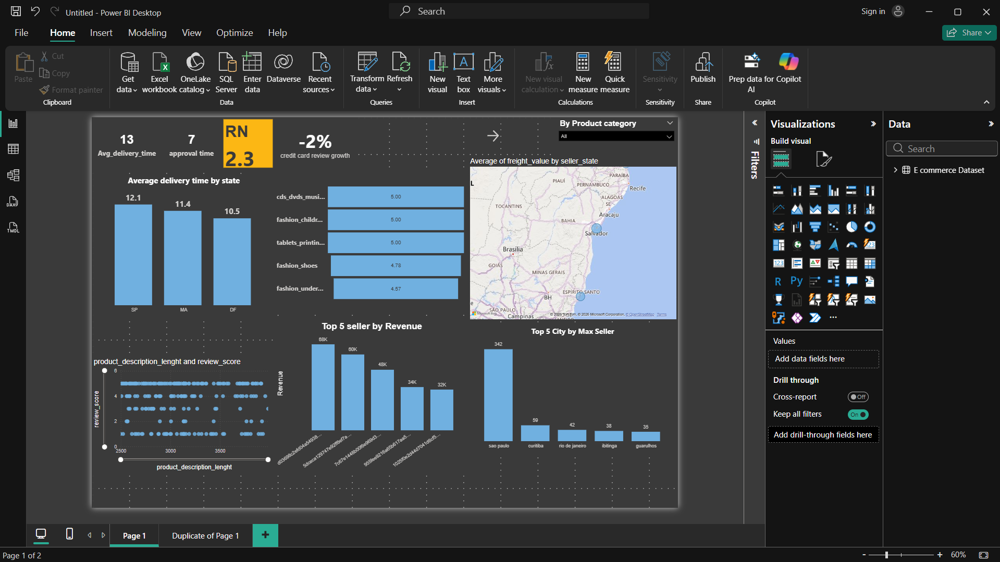

# 📊 E-Commerce Sales Analysis Dashboard (Power BI)

## 📌 Project Overview

This project analyzes an **e-commerce dataset using Power BI** to understand sales performance, delivery efficiency, seller performance, and customer review behavior.

The goal of this dashboard is to transform raw transactional data into **actionable business insights** through data cleaning, modeling, and visualization.

The dashboard enables quick exploration of key metrics related to **sales, logistics performance, and product quality.**

---

## 🎯 Business Questions

This dashboard helps answer important business questions such as:

- Which sellers generate the highest revenue?
- Which states have the longest delivery times?
- Which cities contribute the most to total sales?
- How do product descriptions relate to customer review scores?
- Which product categories perform best?

---

## 🛠 Tools Used

- **Power BI Desktop**
- **Power Query** (Data Cleaning & Transformation)
- **DAX** (Calculated Measures)
- **Data Modeling**
- **Interactive Data Visualization**

---

## 📂 Dataset

The project uses a **multi-table e-commerce dataset** containing information about:

- Customers
- Orders
- Products
- Sellers
- Payments
- Reviews

These tables are connected using relationships to represent a **real-world e-commerce transactional system.**

---

## ⚙️ Data Preparation

Before building the dashboard, the dataset was cleaned and transformed using **Power Query**.

Key preparation steps included:

- Handling missing values
- Removing duplicate records
- Correcting incorrect data types
- Creating delivery time calculations
- Removing unnecessary columns
- Standardizing column names

These transformations ensured the dataset was **accurate, consistent, and analysis-ready.**

---

## 📊 Dashboard Features

### KPI Metrics

- Average Delivery Time
- Order Approval Time
- Credit Card Payment Growth

### Performance Analysis

- Top sellers by revenue
- Top cities by sales performance
- Average delivery time by state

### Geographic Analysis

- Freight value by seller state (map visualization)

### Product Insights

- Relationship between product description length and customer review scores

### Interactive Filters

- Product category slicer for dynamic analysis

---

## 📈 Key Insights

Some key observations from the analysis:

- Certain states experience **longer delivery times**, indicating potential logistics inefficiencies.
- A small number of sellers generate a **significant share of total revenue.**
- Major cities such as **São Paulo dominate overall sales performance.**
- Products with more detailed descriptions tend to receive **slightly higher review scores.**

---

## Dashboard Overview

This dashboard provides insights into seller performance, delivery efficiency, and product reviews using Power BI.

---

## 📁 Repository Structure
project-folder/

data/ → raw dataset files
images/ → dashboard screenshots
dashboard/ → Power BI (.pbix) file
README.md → project documentation

---

## 🚀 Running the Dashboard

1. Download the `.pbix` file from this repository.
2. Open the file using **Power BI Desktop**.
3. Load the dataset if prompted.
4. Use filters and visuals to explore sales performance and delivery metrics.

---

## 🎓 Skills Demonstrated

This project demonstrates several important data analytics skills:

- Data cleaning using Power Query
- Building data models in Power BI
- Writing analytical measures using DAX
- Designing interactive dashboards
- Interpreting business insights from data

---

## 🔮 Possible Improvements

Future improvements could include:

- Time-series sales trend analysis
- Advanced profitability metrics using DAX
- Customer segmentation analysis
- Additional KPI metrics and forecasting

---

## 👨‍💻 Author

**Suraj**  
B.Tech AIML Student  
Interested in Data Analytics, Machine Learning, and Data Engineering

If you found this project useful, feel free to ⭐ the repository.
